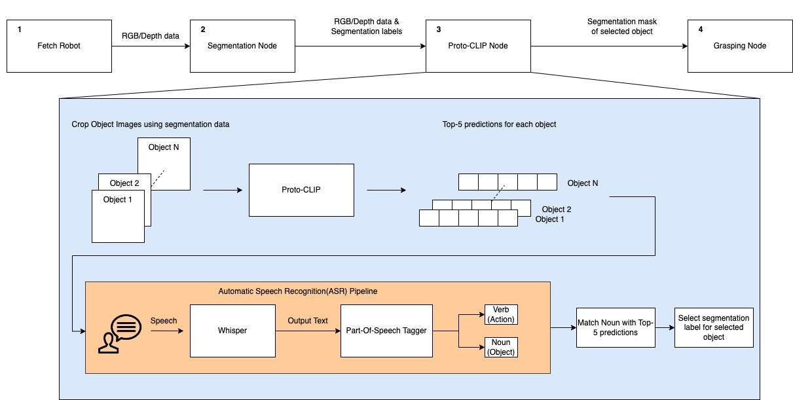
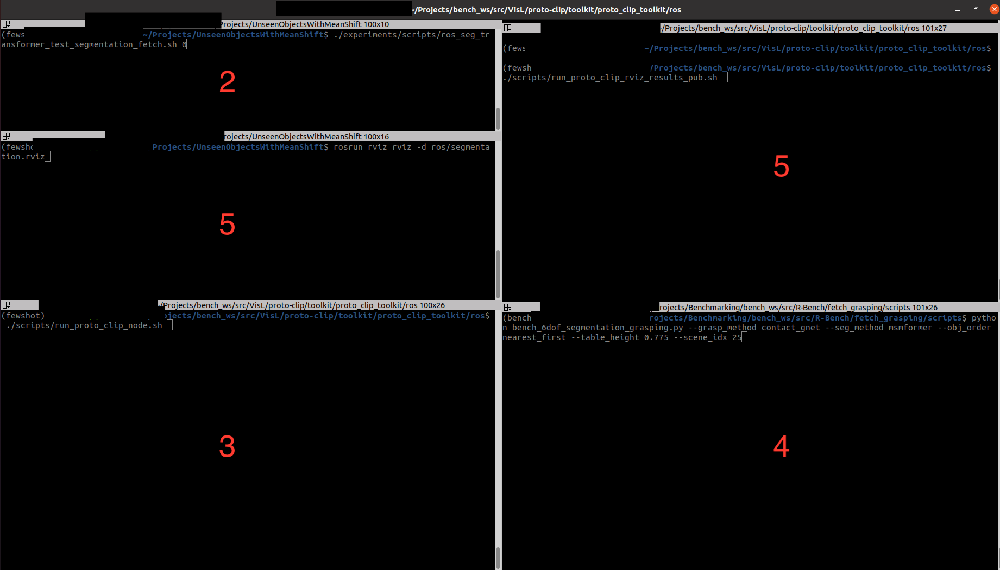

# Proto-CLIP Toolkit

This README explains each of the components of the Proto-CLIP toolkit and provides details on how to run each of them. <br>
The Proto-CLIP toolkit can be accessed by running &nbsp; `pip install proto_clip_toolkit`.

The directory structure shown below describes each of the individual components of the Proto-CLIP toolkit:

```
./proto_clip_toolkit
    |--ros
        |--utils/
        |--scripts/
        |--proto_clip_node.py
        |--proto_clip_results_node.py
    |--utils
        |--tsne.py
        |--model_utils.py
        |--ood_utils.py
    |--pos
        |--configs/
        |--verb_and_noun_tagger.py
    |--asr
        |--configs/
        |--asr_utils.py
        |--transcribe.py
        |--transcribe_with_pos.py
```

## Proto-CLIP real world demo

The real world demo described in the paper is a culmination of multiple individual systems that need to initialized separately. Unfortunately, this means that the real world demo cannot be run using our pypi package alone. You would need to clone to repository and follow the instructions given below.

Since we require multiple systems to be run simultaneously, we recommend using the [Terminator](https://github.com/gnome-terminator/terminator) terminal on Ubuntu. The diagram below describes the system in detail. 




The details on running each of the nodes is given below:

1. **Step-1:** Start the fetch robot
   - If you do not have a fetch robot available, you can setup the Fetch robot in Gazebo and use the same topic names as the original robot. The instructions for setting up gazebo are provided in the SceneReplica repository linked in Step 4.

2. **Step-2:** Run the segmentation node. 
   - First, you would need to clone the following repository [UnseenObjectsWithMeanShift](https://github.com/YoungSean/UnseenObjectsWithMeanShift). Next, cd into the repository and run the following command on your terminal:
   - ```
     ./experiments/scripts/ros_seg_transformer_test_segmentation_fetch.sh $GPU_ID
     ```
3. **Step-3:** Run the Proto-CLIP node. 
   - You need to navigate into the `toolkit/ros` directory and run the following command.:

   - ```
     ./scripts/run_proto_clip_node.sh
     ```

    - **Note**: In case you want to try out different embeddings or a different pretrained-adapter, please modify their values in the config in the script file.

4. **Step-4:** Run the grasping code. Clone the following repository [SceneReplica](https://github.com/IRVLUTD/SceneReplica). Then follow the instructions given below:
    - Replace `/seg_label_refined` in this [line](https://github.com/IRVLUTD/SceneReplica/blob/main/src/utils/image_listener.py#L154) to `/selected_seg_label`.
    - Replace `/seg_score` in this [line](https://github.com/IRVLUTD/SceneReplica/blob/main/src/utils/image_listener.py#L155) to `selected_seg_score`.
    - Replace the `slop_seconds` in this [line](https://github.com/IRVLUTD/SceneReplica/blob/main/src/utils/image_listener.py#L190) to 50.0 . In case, the next steps do not work for you please come back here and increase your slop seconds further.
    - Finally, you can now run the code. Follow the instructions in the README to setup model free grasping. The particular configuration we used in our demo is listed below:

        ```
        --grasp_method contact_gnet --seg_method msmformer --obj_order nearest_first --scene_idx 25
        ```

      - The values supplied to the `obj_order` and the `scene_idx` arguments does not matter since the Proto-CLIP will supply only a single object to the grasping node.
      - The grasping code will prompt you to execute the actions, press enter to proceed to execute them. Once the grasping for an object is complete, you would need to close the code and run it again. Please ensure that you speak the next object for the Proto-CLIP node in 4 only after this code starts running again. This will be certainly painful and we are working on addressing this issue.

5. **Step-5:** If you want to view the results in RViz similar to our paper, run the following command inside the `ros` directory as in step 4. 
    ```
    ./scripts/run_proto_clip_rviz_results_pub.sh
    ```

 - You can find the terminator window below for reference. The numbers represent the sequence number mentioned before.



## Part of Speech Tagging(POS)

- The Part of Speech(POS) tagging module currently uses flair underneath to perform tagging. 
- We have included the `VerbAndNounTagger` class in the POS package.
- The module needs to be initialized with a list of acceptable verbs and nouns.
- The `tag_sentence` functions returns a list containing a tuple of each word and its tag.
- The `find_valid_noun_and_verb` function finds a valid verb and the noun from in the sentence that are present in the dictionary, if not it returns `None` for either of the values.
- This can be useful for robotics application when you want to identify the action(verb) and object(noun) in a given sentence.

Here are sample code on how to use the APIs in your python code.

```
from proto_clip_toolkit.pos import VerbAndNounTagger

asr_verbs_path = "proto_clip_toolkit/pos/configs/verbs_dictionary.txt"
asr_nouns_path = "proto_clip_toolkit/pos/configs/nouns_dictionary.txt"

pos_tagger = VerbAndNounTagger(asr_verbs_path, asr_nouns_path)
sentence = "Pick the mustard bottle."

word_tag_list = pos_tagger.tag_sentence(sentence) # [("Pick", "VB"), ("the", "DT"), ("mustard", "NN"), ("bottle", "NN")]
verb, noun = pos_tagger.find_valid_noun_and_verb(sentence) # "pick", "mustard bottle"
```

## Automatic Speech Recognition(ASR)

- The ASR module can be found inside the `asr/` directory.
- There are two major functions exported by this module `transcribe` and `transcribe_with_verb_and_noun_matching`.
  - The `transcribe` function takes in speech input and prints the output to the console.
  - The `transcribe_with_verb_and_noun_matching` function is a modified function written for Proto-CLIP grasping. The function transcribes the speech and matches the action(verb) and object(noun) using the Part of Speech (POS) tagging module. 
  - The specifics of this module is described in the next section. However, when the module finds a correct action and object, the module stops and returns them. 

- The ASR requires the user to specify the config which can be found in the `asr/configs` directory inside the toolkit.
- The parameters of the config are explained below:

```
{
    "model": "The name of the ASR model you want to use",
    "non_english": "Boolean specific to whisper which specifies if you want to transcribe to a non-english language",
    "energy_threshold": "The energy threshold controls the sensitivity of your microphone for it to start the transcription. Recommended Value is 1000",
    "record_timeout": "Timeout in seconds for recording",
    "phrase_timeout": "Timeout in seconds for the length of the phrase to record" ,
    "default_microphone": "Name of your microphone"
}
```
- Below is a sample code on how to run the `transcribe` and `transcribe_with_verb_and_noun_matching` functions using our package.

```
from proto_clip_toolkit.asr import transcribe, transcribe_with_verb_and_noun_matching
from proto_clip_toolkit.pos import VerbAndNounTagger

asr_config_path = "proto_clip_toolkit/asr/configs/asr_config.json"

transcribe(asr_config_path) #Follow the prompts on your terminal and start speaking when prompted.

asr_verbs_path = "proto_clip_toolkit/pos/configs/verbs_dictionary.txt"
asr_nouns_path = "proto_clip_toolkit/pos/configs/nouns_dictionary.txt"

pos_tagger = VerbAndNounTagger(asr_verbs_path, asr_nouns_path)
spoken_action, spoken_object = transcribe_with_verb_and_noun_matching(asr_config_path, pos_tagger) #Follow the prompts on your terminal and start speaking when prompted.
```
- The ASR and POS module are provided in this toolkit for you to experiment with different models for ASR and POS based on your needs.

## Utils

### tSNE

- Due to conflicts in the naming scheme inside proto-clip and hugging face, please create a separate conda environment if you want to test the tSNE apis.
- For tSNE, you also need to rename the `datasets` directory in the main repository to `proto_datasets`.
- The tSNE module allows you to plot the tSNE for the visual and textual embeddings of Proto-CLIP before and after training them.
- To run the code follow the command given below:

```
#Before training tSNE
python proto_clip_toolkit/utils/tsne.py --config ../configs/fewsol_198.yml \
    --splits_path ../splits/fewsol_splits_198.json \
    --memory_bank_v_path ../pretrained_ckpt/fewsol-198-F/memory_bank_v.pt
    --memory_bank_t_path ../pretrained_ckpt/fewsol-198-F/memory_bank_t.pt

#After training tSNE
python proto_clip_toolkit/utils/tsne.py --config ../configs/fewsol_198.yml \
    --splits_path ../splits/fewsol_splits_198.json \
    --memory_bank_v_path ../pretrained_ckpt/fewsol-198-F/memory_bank_v.pt
    --memory_bank_t_path ../pretrained_ckpt/fewsol-198-F/memory_bank_t.pt
    --after_train
```

- In case you want to reuse our plots using a different set of embeddings, you can call the functions in the manner specified below:

```
from proto_clip_toolkit.utils.tsne import plot_tsne_before, plot_tsne_after

image_embeddings = ... (Shape: N x K)
text_embeddings = ... (Shape: N x K')
text_prompts = ... (Shape: N x 1) (String array to display text)

plot_tsne_before(image_embeddings, text_embeddings, text_prompts)
plot_tsne_after(image_embeddings, text_embeddings, text_prompts)
```

### Out-Of-Distribution (OOD) datasets test

- The OOD module allows you to test the Proto-CLIP model on OOD datasets.
- This purely an API and we have provided the sample code to call the API below:

```
import yaml
from proto_clip_toolkit.utils.ood_utils import test_ood_performance

config_path = "../configs/fewsol_198.yml"
config = yaml.load(open(config_path, 'r'), Loader=yaml.Loader)
memory_bank_v_path = "../pretrained_ckpt/fewsol-198-F/memory_bank_v.pt"
memory_bank_t_path = "../pretrained_ckpt/fewsol-198-F/memory_bank_t.pt"
adapter_weights_path = "../pretrained_ckpt/fewsol-198-F/query_adapter.pt"


imagenet_v2_test_acc = test_ood_performance(config, "imagenet_v2", 1, 1, memory_bank_v_path, memory_bank_t_path, "fc", adapter_weights_path)
imagenet_sketch_test_acc = test_ood_performance(config, "imagenet_sketch", 1, 1, memory_bank_v_path, memory_bank_t_path, "fc", adapter_weights_path)
```

- If you want to test our model on more datasets, you can add the code for the dataset loader in the `ood_utils.py` file and add a keyword for it.